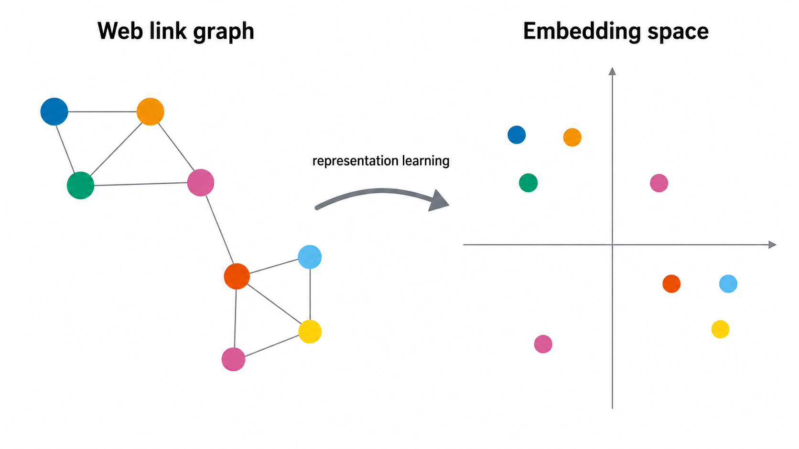
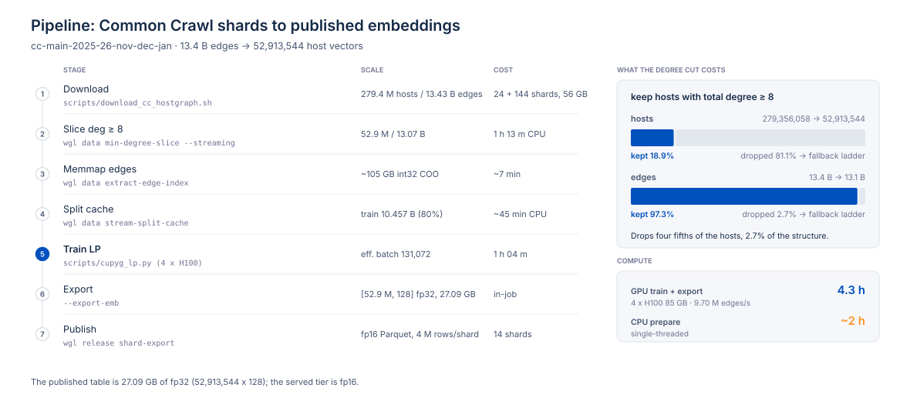
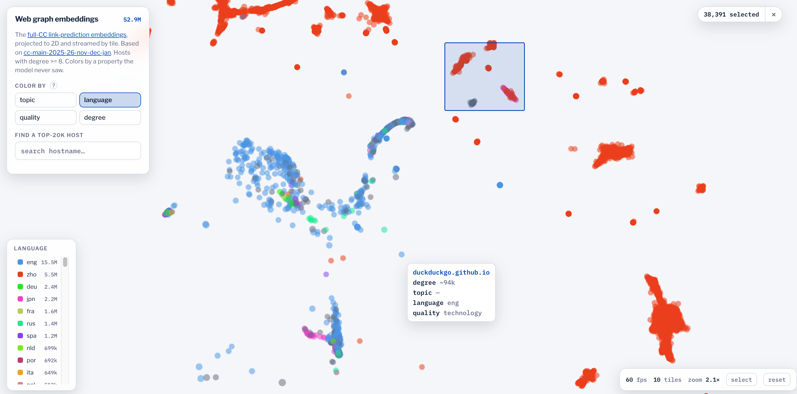
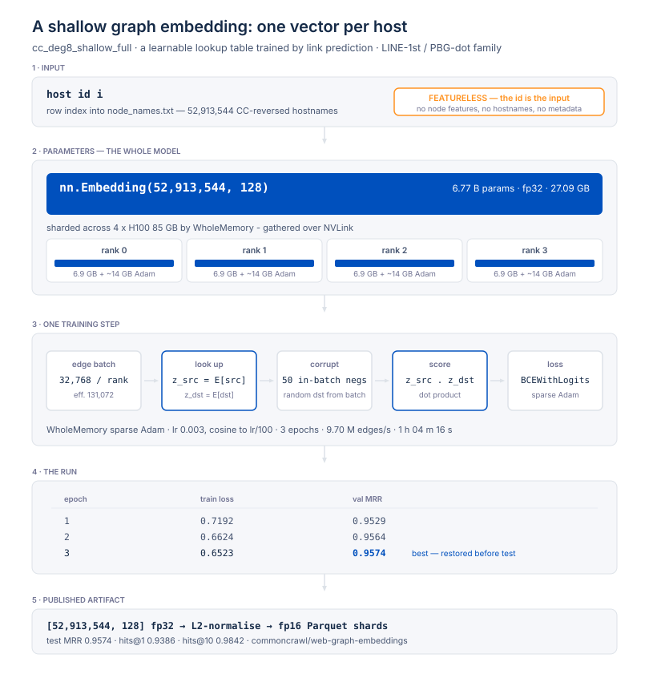

# Common Crawl web-graph embeddings

Dense vector representations of **52.9 million web hosts**, learned from the hyperlink structure of
the Common Crawl host graph alone — no page content, no text, no features of any kind.

Two hosts end up close together when they sit in similar neighbourhoods of the link graph. That
turns out to be a useful, cheap prior for site-level tasks: topical clustering, near-duplicate and
mirror detection, candidate generation, and as a complementary feature for spam ranking.



**Download:** [`commoncrawl/web-graph-embeddings`](https://huggingface.co/datasets/commoncrawl/web-graph-embeddings)
on the Hugging Face hub.

**Reproduce:** [`REPRODUCE.md`](REPRODUCE.md) — six commands from raw Common Crawl shards to the
published Parquet shards. This repository is exactly the code that produced the release, and nothing
else.



---

## The artifact

| | |
|---|---|
| Rows | 52,913,544 hosts |
| Dimensions | 128 |
| Precision | fp32 (canonical) + fp16 sidecar |
| Size | 27.1 GB fp32 / 13.5 GB fp16 |
| Geometry | L2-normalized; compare with **cosine similarity** (equivalently, dot product) |
| Source | Common Crawl host graph `cc-main-2025-26-nov-dec-jan` |

Published as Parquet shards with a checksummed `manifest.json`. Each row:

| column | type | meaning |
|---|---|---|
| `row_id` | int64 | global row index; `shard = row_id // rows_per_shard` |
| `host_key` | string | the host, forward form (`www.example.com`) |
| `domain_key` | string | registrable domain / PLD (`example.com`) |
| `embedding` | fixed_size_list<float>[128] | the vector |

```python
import pyarrow.parquet as pq
import numpy as np

t = pq.read_table("vectors/emb-00000-of-00014.parquet")
hosts = t["host_key"].to_pylist()
vecs = np.stack(t["embedding"].to_numpy(zero_copy_only=False))  # [n, 128], already L2-normalized
sim = vecs @ vecs[0]                                            # cosine similarity to row 0
```

## Explore it in the browser

Two Hugging Face Spaces let you inspect the released vectors without downloading the full dataset.

[](https://huggingface.co/spaces/commoncrawl/web-graph-embeddings)

**[2D map](https://huggingface.co/spaces/commoncrawl/web-graph-embeddings)** — an interactive
projection of all 52.9 M hosts, streamed by tile. Pan and zoom, hover any point for its hostname
and stats, or jump to one of the top 20k hosts by name. The same layout recolours by link degree,
topic, content language or quality, which makes it easy to see where the embedding separates a
property and where it does not — the view above is coloured by language.

**[Nearest-neighbour search](https://huggingface.co/spaces/commoncrawl/web-graph-knn)** — type a
hostname and get its closest hosts in the full 128-dimensional space rather than in the 2D
projection. All 52,913,544 hosts are indexed. It is the quickest way to check what the embedding
considers "similar" for a site you already know well.

## What the model is

A **shallow, featureless, transductive first-order graph embedding**: one learnable 128-dimensional
lookup table over hosts, scored by inner product, trained with binary cross-entropy against
uniformly sampled corrupted destinations. It is comparable to the **LINE first-order /
PyTorch-BigGraph dot** family.



| | |
|---|---|
| Objective | link prediction; `score(u,v) = e_u · e_v`, BCE on 1 positive vs 50 uniform negatives |
| Encoder | `--encoder shallow` — the table itself, no message passing |
| Training | 3 epochs over 10.46 B train edges, lr 0.003 cosine, batch 32,768/rank (131,072 effective) |
| Hardware | 4×H100, **1 h 04 m** wall, ~9.7 M edges/s, table sharded with WholeGraph/WholeMemory |
| Held-out LP | `test_mrr 0.9574`, `hits@1 0.9386`, `hits@10 0.9842` (vs 100 random negatives) |

Because the scorer is symmetric, **edge direction is discarded** — `e_u · e_v` cannot distinguish a
link from its reverse. The graph is directed; the embedding is not.

## Evaluation

The model is trained only to predict links, so every result below is a probe of what link structure
alone turns out to encode. Held-out link prediction is near-saturated (`test_mrr 0.9574`); the
interesting question is what transfers.

### Topic — the strongest transfer

A logistic probe on the raw vectors reaches **macro-F1 0.388** over 24 WebOrganizer topics, against
**0.062** for a majority-topic-per-TLD baseline — about **6×** the identity baseline, on 170,399
labelled hosts. Link structure makes a site's topic close to linearly separable.

### Language — near-perfect on well-connected hosts

A single 120-class macro-F1 badly understates this, because it averages over many classes with
almost no held-out support. Stratified by link degree the signal is unambiguous (300,000 held-out
hosts, cosine kNN):

| host degree | accuracy | neighbour-precision | weighted-F1 | macro-F1 @sup≥20 |
|---|--:|--:|--:|--:|
| 8–16 | 0.613 | 0.455 | 0.525 | 0.095 |
| 128–512 | 0.740 | 0.662 | 0.710 | 0.326 |
| 512–4096 | 0.921 | 0.892 | 0.913 | 0.596 |
| ≥ 4096 | **0.980** | **0.970** | **0.976** | **0.713** |

Overall accuracy is 0.673 and weighted-F1 0.612. Mid-resource languages climb from the floor to
strong as degree rises — Spanish 0.02 → 0.45, Polish 0.03 → 0.95, Indonesian 0.02 → 0.83. **The more
links a host has, the more precisely the embedding places its language.**

### Spam — an independent and unusually durable signal

The embedding never saw a spam label. Compared with **Anti-TrustRank** (ATR), the classic link-based
spam algorithm, over 52.6 M candidate hosts:

- **They are not the same signal.** Spearman(embedding, ATR) = **−0.04**.
- **The embedding is the better clean-vs-spam discriminator.** Against operator-reviewed clean
  sites, gold-AUROC is **0.937** for the graph-propagated embedding, **0.874** for a plain logistic
  probe, and 0.865 for ATR.
- **It detects what ATR cannot.** At a 1% false-positive budget against hard, spam-shaped sites that
  reviewers had manually cleared, the embedding finds **40%** of known spam where ATR finds ~0%; at a
  5% budget, **74%** vs ~0%.
- **It cuts false positives 4.5×.** Using ATR for recall and the embedding to vet its top 1,000 drops
  legitimate false positives from 0.122 to **0.027**, holding spam precision at 0.967.
- **It survives a crawl change.** On spam labelled from a *later* crawl, ATR's gold-AUROC falls to
  0.56 — chance — while the embedding still ranks it (enrichment **173×**, AUROC 0.91).

ATR remains the stronger raw ranker on the easy full-web pool (enrichment@1k 117.8×). The practical
recipe is both: ATR for recall, the embedding to vet its hits and to catch the spam that
guilt-by-association misses.

**In one line: link structure alone carries a surprising amount of what a site is** — its topic, its
language wherever the host is well connected, and a spam signal independent of the classic
link-based one.

## Coverage and limitations

- **Only the well-connected core.** Training used hosts with total degree ≥ 8: 52.9 M of the crawl's
  279.4 M hosts (**19%**), covering 13.07 B of ~13.4 B edges. The 81% long tail — hosts with almost
  no links — is *not* in this artifact. There is no vector for a host that was not trained.
- **Transductive.** There is no encoder to apply to a new host; a host absent from the training crawl
  cannot be embedded without retraining.
- **Direction-blind**, as above.
- **One crawl window.** Vectors from different releases are not comparable — the model space is
  arbitrary up to rotation, so a new release means a new space (tracked by `model_space_version` in
  the manifest).
- **Spam metrics are a conservative floor.** The label sets are partial, so unlabelled true spam is
  scored as a false positive; real precision is better than the numbers above.

## Repository layout

```
src/wgl/            the `wgl` CLI: preprocessing (stages 2-4) and the hub export (stage 6)
  data/             Common Crawl shard parsing, the min-degree slice, the split cache
  release/          Parquet shard export, stable host/PLD identity keys, manifest
scripts/            the trainer, which runs in the GPU container and does not import `wgl`
  cupyg_lp.py       entry point; cupyg/ holds the model, split, loaders, loss, eval, checkpointing
docker/             the two container images (CPU tooling; cuGraph-PyG + WholeGraph for training)
tests/              unit tests for every stage above
```

The CPU package is intentionally light — `numpy`, `typer`, `rich`, plus `pyarrow` and `tldextract`
for the export. The GPU stack lives in the container image, not in project metadata.

```bash
make setup   # uv venv + install
make check   # ruff lint + format check
make test    # unit tests
```

## Citation

If you use these embeddings, please cite the Common Crawl web graph release they are derived from,
and note the model as a LINE-1st / PyTorch-BigGraph-dot style shallow first-order embedding.

## License

Apache-2.0 — see [`LICENSE`](LICENSE). The underlying Common Crawl host graph is published by the
Common Crawl Foundation under its own terms.
